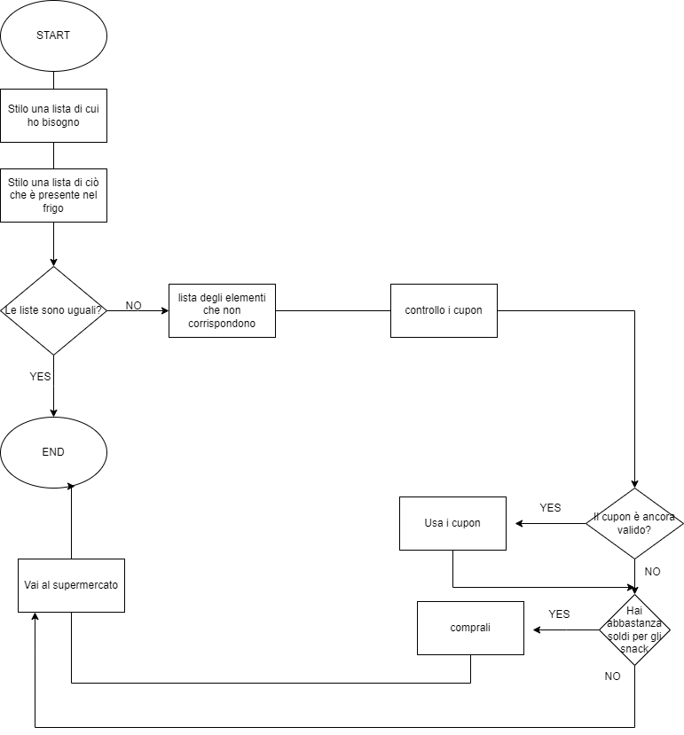

# Fare la spesa seguendo una lista

### Testo esercizio
Nel frigo si inizia a sentire l’eco, perciò è ora di fare rifornimenti!
Visto che dimentico sempre qualcosa, decido di appuntarmi tutto ciò che manca in una lista, così una volta al supermercato, girando tra gli scaffali, posso verificare di aver preso tutto e Ricky non rimane senza crocchette come l’ultima volta, povero! Devo ricordarmi di usare il coupon che scade a fine mese, per il resto dovrebbero bastarmi i contanti che ho in portafogli, sempre se non mi faccio prendere la mano con gli snack extra! 

## Soluzione:

### Dati:
- Lista di cose di cui ho bisogno
- Lista alimenti presenti nel frigo

### Procedimento:
1. Controllo se le due liste hanno gli stessi elementi 
    - **SE** liste sono uguali 
        -Non ho bisogno di fare la spesa
    - **Altrimenti**
        - Segno gli alimenti che non sono presenti nella lista di alimenti da comprare
2. Controllo i cupon
3. Il cupon è ancora valido?
    - **SE** è ancora valido lo utilizzerò
    - **Altrimenti** non lo userò
4. Controllo se ho abbstanza soldi per gli snack
    - **SE** ne ho abbastanza
        - comprerò gli snack
    : **Altrimenti** vado al supermercato senza comprarli

### Diagramma di flusso

